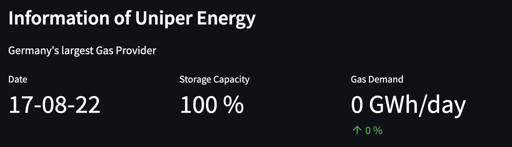
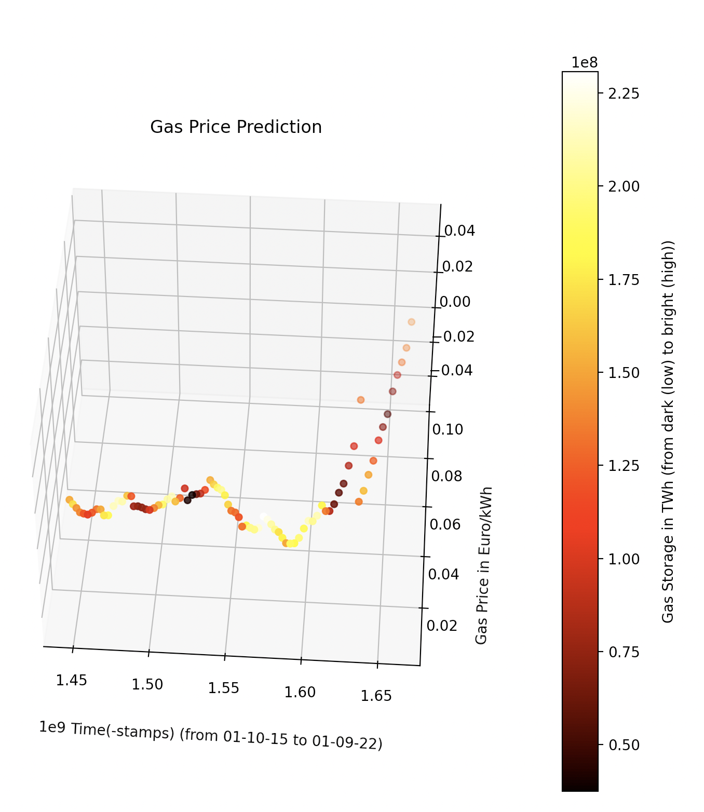
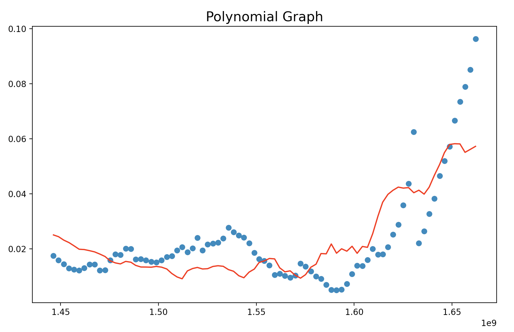
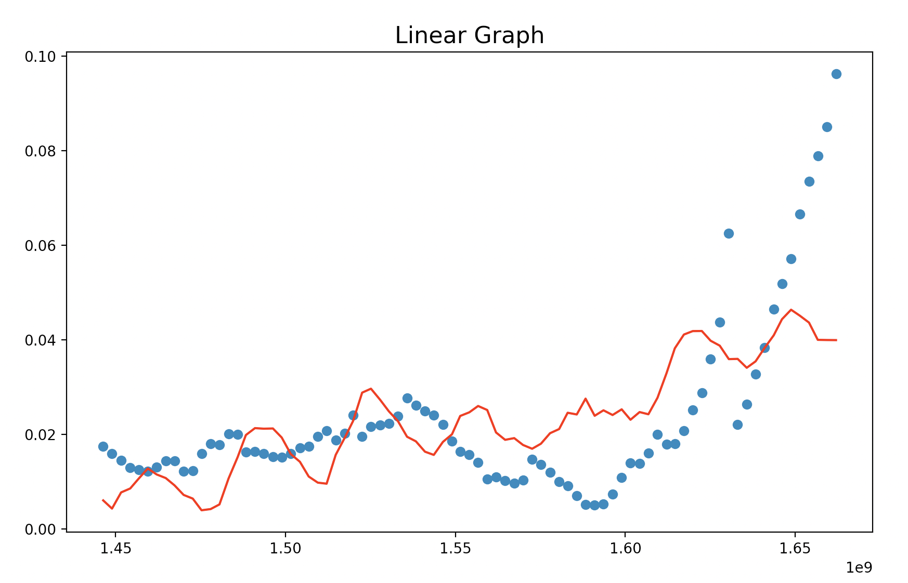
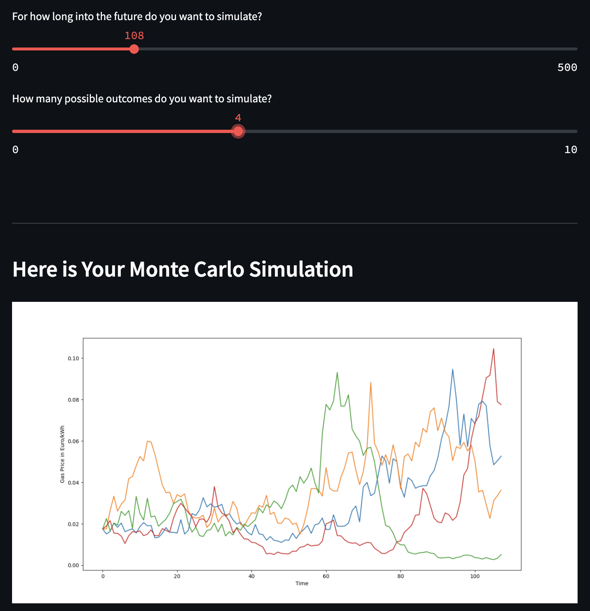

### About this Project
    
    War has direct impact on our daily lives. Especially the economy.
    Moreover due to high imports from russia, germany suffers an explosion
    in gas prices for the past months, hence the decreased supply from
    various reasons.

    In order to help households to make better financial decisions and ease
    financial uncertainty, in this Project we predict the gas price and gas costs.

    The 2 regressor variables are:
    - x1 = Time (control variable)
    - x2 = Gas Storage (in relation to demand and supply. For further information see: https://agsi.gie.eu/historical/DE)

    The predictor variable is:
    - f (x1, x2) = Gas Price

#### Moreover an API was implemented, showing information about gas from Germany's largest gas provider Uniper Energy:

### Datesets used for this Project

    Gas consumption for 2-person-househould per year: 10000 kWh:

https://www.bosch-thermotechnology.com/de/de/wohngebaeude/wissen/heizungsratgeber/gasheizung/gasverbrauch/#:~:text=Wie%20viel%20Gas%20verbraucht%20ein,bei%2020.000%20bis%2040.000%20kWh.

    Gas price (EUR/kWh) from GASPOOL and Trading Hub Europe (THE) - responsible for german gas market.
   
    Data from 1.10.2015 - 01.09.2021 from: 
https://www.tradinghub.eu/Portals/0/Archiv%20NCG/20211019_Monatsdurchschnittspreise_20211019.xlsx?ver=SfV9SAubpW1e1bGte96d4Q%3d%3d
    
    Data from 01.10.2021 - 01.08.2022 from: 

https://www.tradinghub.eu/en-gb/Publications/Prices/Reconciliation-price

    German Gas Storage Capacity (in TWh)
    1.10.2015 - 01.08.2022: 
https://agsi.gie.eu/historical/DE

    The Data was collected between 01.10.2015 and 15.08.2022 
    (Further see the raw dataset in Dataset/Gas_Dataset.csv).
### About the Data and Model

    The Scatter Plot shows how Gas Storage, Time and Gas Price relates to each other.

    Time Legend:
    1.45 * 1e9 = 13.12.2015 (Late Autumn)
    1.50 * 1e9 = 14.07.2017 (Mid Summer)
    1.55 * 1e9 = 12.02.2019 (Mid Winter)
    1.60 * 1e9 = 13.09.2020 (Late Summer)
    1.65 * 1e9 = 15.04.2022 (Mid Spring)

    It seems, that gas prices on the hand are affected by natural causes (change in temperatur hence seasons),
    by which the storage capacities fluctuate; i.e. the scatter plot shows, that the storage capacity reaches
    Minima (darker color) in colder seasons. However, the storage capacity is a strong indicater for the gas price.
    I.e. right after timestamp 1.60 * 1e9 (13.09.2020) marks a turning point. There storage capacities seem to 
    decrease and stay at a minimum. At the same time, the gas price spikes in an exponential manner.
    Before that time, the storage capacity was more or less reaching maxima. This could be due to the COVID-19 
    situation, where companies reduced trading and economic activity. So, the spike could also be explained by the 
    increasing demand for gas, hence companies increased their activities again, due to decreasing spread of SarS-Cov2
    Virus.

    Hence seasonal fluctuations in temperature and the change in Minima and Maxima, as well as the expontential
    slope at the end of the timeline, a polynomial regression model seems suitable (despite also a mulitple linear
    regression model is used) for forecasting the future gas price.

### Polynomial and Linear Functions

###### Polynomial Function
    f(x1, x2) = 5.02 + -6.69e-09 * x1 + 1.25e-09 * x2 + 2.24e-18 * x1^2 + -7.83e-19 * x2^2 + -3.19e-19 *x1 * x2

    
###### Linear Function
    f(x1, x2) =-0.20  + 1.52e-10 * x1 + -1.032e-10 * x2

    

### Model Performance
    
    Polynomial Function MAE = 0.008515221391126407
    Linear Function MAE = 0.010370585662079948
    Polynomial Function R Squared = 0.6370797480659653
    Linear Function R Squared = 0.3944088902790577

### Implications and Outlook

1) The model can be used to make predictions for privat households in order to make
    better financial decisions.

    
2) The model can be used to reduce uncertainty due to gas price fluctuations.

3) The gas price forecasting can be better detailed by implementing future possible outcomes, which affect storage  i.e.:
   - sudden increase by X % in storage by reduced conflicts/wars.
   - rising temperates by X % due to climate change decreases need for storage by X %.
   - ...
   

    The mentioned outlook affecting storage can be modelled i.e. 
    via Monte Carlo Randomization. For example continue timestamps
    by N iterations and adjust storage coefficient for each case by
    N %. I.e.:

    1 Case - 1000 timestamps iterations into future: decrease of quarterly storage capacity by 0.5 percent.
    2 Case - 2000 timestamps iterations into future: increase of monthly storage capacity by 1.5 percent.
    3 Case - 2000 timestamps iterations into future: first 500 iterations decreasing storage capacity by 0.3 percent,
                                                     sudden spike by 30% for 200 iterations and increasing capacity
                                                     by 0.5 percent for the last 1300 iterations.
    
    and so on ...

    Those Cases can be visualized for easier understanding.

##### Monte Carlo for future Price Predictions
    
    Unlike a traditional forecast, a Monte Carlo-based forecast does not produce a single number, 
    but instead provides a range of possible outcomes at a probability distribution. 

###### Formulas for Monte Carlo

    Today_Price = Yesterday_Price * e^r
    r = drift + vol * z
    drift = mean - 0.5 * var

#### Monte Carlo Example

